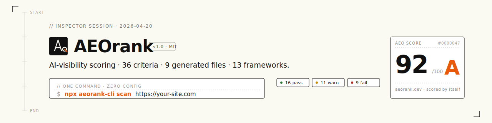

<p align="center">
  
</p>

<h3 align="center">Your site ranks #1 on Google — but is invisible to ChatGPT.</h3>

<p align="center">
  AEOrank scores your AI visibility 0–100 across <strong>36 criteria</strong>, then generates the <strong>9 files</strong> that get you cited by ChatGPT, Perplexity, Claude, and Google AI Overviews.
</p>

<p align="center">
  <a href="https://www.npmjs.com/package/aeorank-cli"></a>
  <a href="https://www.npmjs.com/package/@aeorank/core"></a>
  <a href="https://github.com/marketplace/actions/aeorank-aeo-scanner"></a>
  <a href="https://github.com/apps/aeorank"></a>
  <a href="LICENSE"></a>
  <a href="https://github.com/vinpatel/aeorank/stargazers"></a>
</p>

<!-- STATS_START -->


<!-- STATS_END -->

<p align="center">
  <a href="https://aeorank.dev">Website</a> &nbsp;·&nbsp;
  <a href="https://docs.aeorank.dev">Docs</a> &nbsp;·&nbsp;
  <a href="https://app.aeorank.dev">Dashboard</a> &nbsp;·&nbsp;
  <a href="https://github.com/marketplace/actions/aeorank-aeo-scanner">GitHub Action</a> &nbsp;·&nbsp;
  <a href="https://github.com/apps/aeorank">GitHub App</a>
</p>

---

**One command. Zero config. Instant score.**

```bash
npx aeorank-cli scan https://your-site.com
```

```
AEO Score: 72/100 (B)

  Answer Readiness           68%  ██████▊░░░
  Content Structure          81%  ████████░░
  Trust & Authority          59%  █████▉░░░░
  Technical Foundation       90%  █████████░
  AI Discovery               44%  ████▍░░░░░

  Top recommendations:
  1. Create /llms.txt with H1 title and sections
  2. Allow GPTBot, ClaudeBot in robots.txt
  3. Add FAQPage schema with 3+ Q&A pairs
```

## Why does this matter?

AI search engines now drive **40% of web discovery**. ChatGPT converts visitors at **15.9%** — higher than Google organic. But traditional SEO tools don't check what AI engines actually look for.

AEOrank does.

## AEOrank vs the competition

Every other AEO tool is paid SaaS targeting marketers. AEOrank is the **only open-source, developer-native** AEO tool.

| | AEOrank | Scrunch | Adobe LLM Optimizer | Semrush AI |
|---|:---:|:---:|:---:|:---:|
| **Price** | **Free / MIT** | $499+/mo | Enterprise | $129+/mo |
| **Open source** | ✅ | ❌ | ❌ | ❌ |
| **CLI** | ✅ | ❌ | ❌ | ❌ |
| **GitHub integration** | ✅ Action + App | ❌ | ❌ | ❌ |
| **Framework plugins** | **13** | 0 | 0 | 0 |
| **Generates AI files** | ✅ 9 files | ❌ | ❌ | ❌ |
| **Scoring criteria** | 36 | Varies | Varies | Varies |
| **Self-hostable** | ✅ | ❌ | ❌ | ❌ |

## Three ways to use it

### 1. CLI — scan any URL

```bash
npx aeorank-cli scan https://your-site.com
```

### 2. GitHub App — zero-config PR checks

Install the [AEOrank GitHub App](https://github.com/apps/aeorank) on your repo. Every PR automatically gets an AEO score as a Check Run — no YAML, no config.

### 3. GitHub Action — CI pipeline control

```yaml
name: AEO Score
on: [push, pull_request]

permissions:
  checks: write
  pull-requests: write
  contents: read

jobs:
  aeo:
    runs-on: ubuntu-latest
    steps:
      - uses: vinpatel/aeorank-action@v1
        with:
          url: https://your-site.com
          fail-below: 50
```

## 36 criteria across 5 pillars

| Pillar | Weight | What it checks |
|--------|--------|----------------|
| 🎯 **Answer Readiness** | 30% | Topical authority, fact density, citation-ready writing, duplicate content, evidence packaging |
| 📐 **Content Structure** | 21% | Q&A format, direct answers, heading hierarchy, tables/lists, definition patterns |
| 🏛️ **Trust & Authority** | 16% | E-E-A-T signals, internal linking, author schema, meta descriptions |
| ⚙️ **Technical Foundation** | 14% | Schema.org coverage, semantic HTML, image context, extraction friction, speakable markup |
| 🔍 **AI Discovery** | 19% | llms.txt, AI crawler access, content licensing, canonical URLs, RSS feed, sitemap freshness |

## 9 generated files

AEOrank generates all the files AI engines look for:

| File | Purpose |
|------|---------|
| `llms.txt` | Site summary for LLM crawlers ([llmstxt.org](https://llmstxt.org) spec) |
| `llms-full.txt` | Full-context version with Q&A pairs and entity disambiguation |
| `ai.txt` | AI usage permissions and licensing |
| `CLAUDE.md` | Markdown context file for Claude |
| `schema.json` | JSON-LD structured data |
| `robots-patch.txt` | AI-specific robots.txt rules |
| `faq-blocks.html` | FAQ with schema.org + speakable markup |
| `citation-anchors.html` | Deep-linkable citation anchors |
| `sitemap-ai.xml` | AI-optimized sitemap |

## Framework plugins

Drop-in AEO file generation. One config, 9 files, zero maintenance.

<p align="center">
  <a href="https://docs.aeorank.dev/frameworks/next/"></a>
  <a href="https://docs.aeorank.dev/frameworks/astro/"></a>
  <a href="https://docs.aeorank.dev/frameworks/nuxt/"></a>
  <a href="https://docs.aeorank.dev/frameworks/remix/"></a>
  <a href="https://docs.aeorank.dev/frameworks/sveltekit/"></a>
  <a href="https://docs.aeorank.dev/frameworks/gatsby/"></a>
  <a href="https://docs.aeorank.dev/frameworks/shopify/"></a>
  <a href="https://docs.aeorank.dev/frameworks/11ty/"></a>
  <a href="https://docs.aeorank.dev/frameworks/vitepress/"></a>
  <a href="https://docs.aeorank.dev/frameworks/docusaurus/"></a>
  <a href="https://docs.aeorank.dev/frameworks/wordpress/"></a>
</p>

```bash
npm install @aeorank/next    # or @aeorank/astro, @aeorank/nuxt, etc.
```

```ts
// next.config.ts
import { withAeorank } from "@aeorank/next";

export default withAeorank({
  siteName: "My Site",
  siteUrl: "https://example.com",
  description: "What my site does.",
});
// → All 9 AEO files now served at your site root
```

## SaaS Dashboard

Track your AEO score over time at [app.aeorank.dev](https://app.aeorank.dev):

- Scan any URL → full 36-criteria breakdown
- 30-day score history with sparkline charts
- Download all 9 generated files as a ZIP
- Free tier: 1 site, 3 scans/month

## Packages

| Package | Description |
|---------|-------------|
| [`aeorank-cli`](https://www.npmjs.com/package/aeorank-cli) | CLI — `npx aeorank-cli scan <url>` |
| [`@aeorank/core`](https://www.npmjs.com/package/@aeorank/core) | Core scanning + scoring engine |
| [`@aeorank/next`](https://www.npmjs.com/package/@aeorank/next) | Next.js plugin |
| [`@aeorank/astro`](https://www.npmjs.com/package/@aeorank/astro) | Astro integration |
| [`@aeorank/nuxt`](https://www.npmjs.com/package/@aeorank/nuxt) | Nuxt module |
| [`@aeorank/remix`](https://www.npmjs.com/package/@aeorank/remix) | Remix plugin |
| [`@aeorank/sveltekit`](https://www.npmjs.com/package/@aeorank/sveltekit) | SvelteKit plugin |
| [`@aeorank/gatsby`](https://www.npmjs.com/package/@aeorank/gatsby) | Gatsby plugin |
| [`@aeorank/shopify`](https://www.npmjs.com/package/@aeorank/shopify) | Shopify Hydrogen plugin |
| [`@aeorank/11ty`](https://www.npmjs.com/package/@aeorank/11ty) | Eleventy plugin |
| [`@aeorank/vitepress`](https://www.npmjs.com/package/@aeorank/vitepress) | VitePress plugin |
| [`@aeorank/docusaurus`](https://www.npmjs.com/package/@aeorank/docusaurus) | Docusaurus plugin |

## Live Demo

See [DEMO.md](./DEMO.md) for today's auto-generated scan.

Last updated: April 16, 2026

## Contributing

Contributions are welcome. Please open an issue first to discuss what you'd like to change.

```bash
git clone https://github.com/vinpatel/aeorank.git
cd aeorank
pnpm install
pnpm build
pnpm test    # 411 tests
```

## License

[MIT](LICENSE) — Vin Patel
